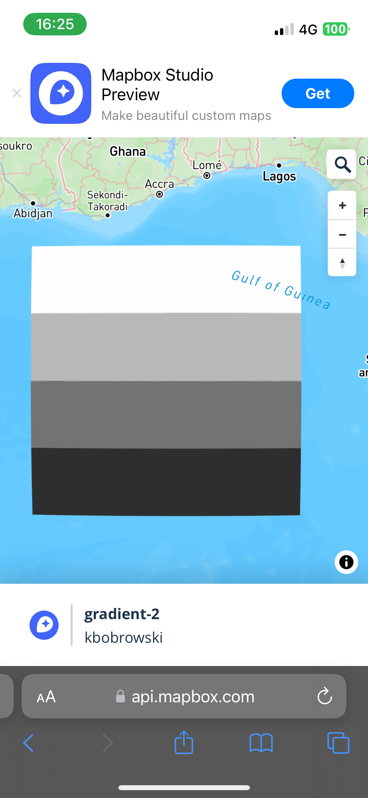
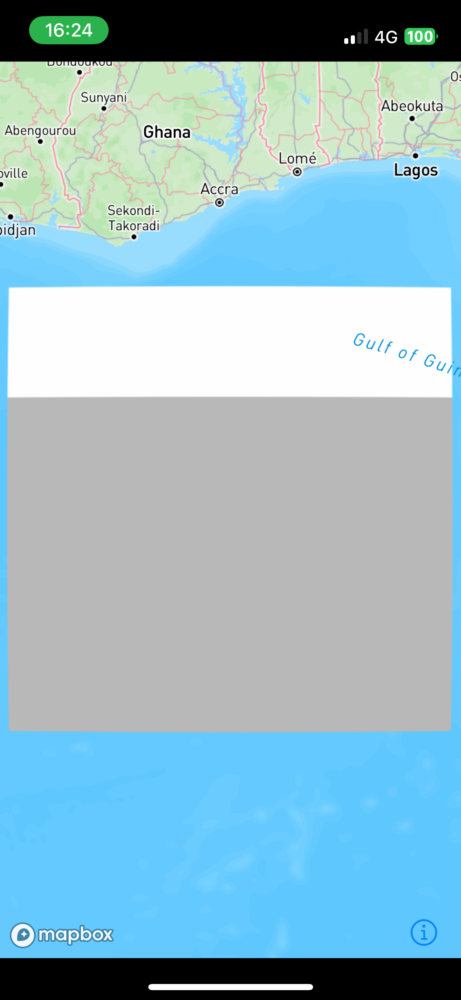

### Issue

Raster array data does not seem to be rendered properly in native iOS app. 

### Example

Source data is a square divided into 4 stripes, points within each stripe have the same value assigned. Values are between 0 and 3. `raster-color` is used to paint low values bright and high values dark.

Data is rendered properly in web environment, but not in native app:

Web             |  iOS
:-------------------------:|:-------------------------:
 | 

See `test-gradient-2.tif` for source data, `test-gradient-recipe.json` for tileset recipe, `style.json` for style (exported from mapbox studio). You can recreate the issue on web and iOS with `example.html` and `example.swift`. Note: for the square to display you need to zoom in to zoom level 5 at [0, 0] coordinates.